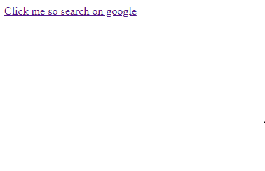

# `05`Create anchor tag

## 📝 Instrucciones:

1. Agrega al cuerpo del sitio web una etiqueta (tag) link o anclaje que diga `Click aqui para buscar en google`

El link debe llevar al usuario a la url. [http://google.com](http://google.com) cuando haga click.

## 💡 Pista:

+ La url dada es una ruta ABSOLUTA porque comienza con "http", eso significa que le está diciendo al navegador que va a llevar al usuario FUERA de tu sitio web.

+ Lee sobre rutas absolutas vs relativas aqui: http://www.coffeecup.com/help/articles/absolute-vs-relative-pathslinks/

## Resultado esperado:

